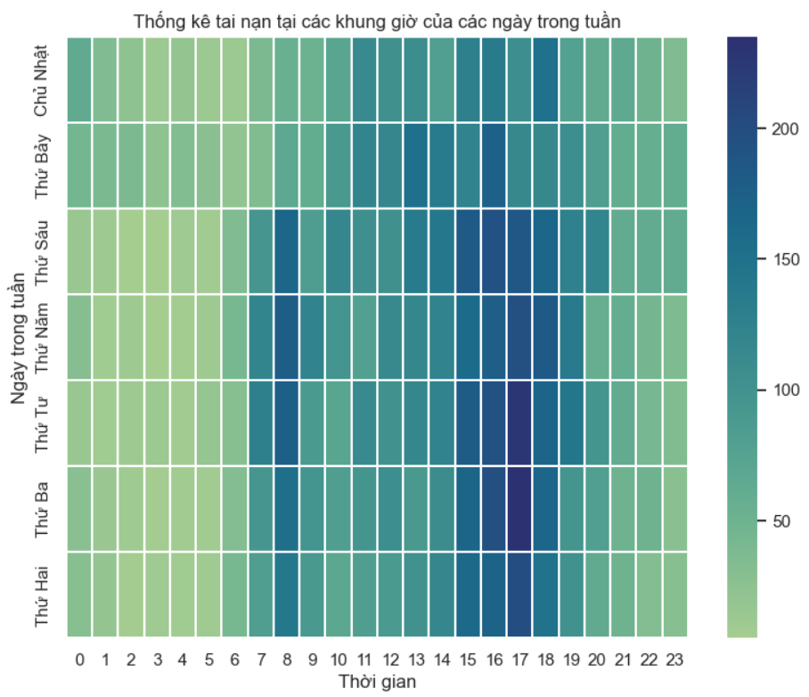

# KHDL-PythonForDS

Traffic Accidents in Canada Analysis

<!-- 
 
| MSSV  | Họ tên |
|:---:|:---:|
| 20280083  | Lại Toàn Thắng  |

 -->

# Đặt câu câu hỏi cho tập dữ liệu Tai nạn Giao Thông
https://docs.google.com/spreadsheets/d/1UG6YbiDmWzxuseNBtZs652whpZgNG6vaiT6ynEhZRBM/edit?usp=sharing

# Installation
1. Chọn folder muốn lưu
2. Chuột phải vào ô trống, chọn "Open in Terminal", "Git GUI here" hoặc "Git Bash here"
3. CLI vs GUI:  
    Cách 1. Nếu sử dụng Terminal, Powershell, git bash, copy đoạn mã dưới vào và Enter  
    git clone https://github.com/laitoanthang/KHDL-PythonForDS.git
    
    Cách 2. Nếu sử dụng git GUI, chọn "Clone Existing Repository" với Source Code https://github.com/laitoanthang/KHDL-PythonForDS.git và Target Directory tùy thích

# Upload code to Github
1. Open terminal tại folder làm việc
2. Chạy các lệnh sau  
    git add.

    git commit -m "điền nội dung commit vào đây"

    git push origin master
 
# Update code from Github
1. Open terminal tại folder làm việc
2. Chạy lệnh sau  
    git pull

# Chia nhánh git
B1. git branch <Tên của mình>  
B2. git add .  
B3. git commit -m "điền nội dung commit vào đây"  
B4. git push 
